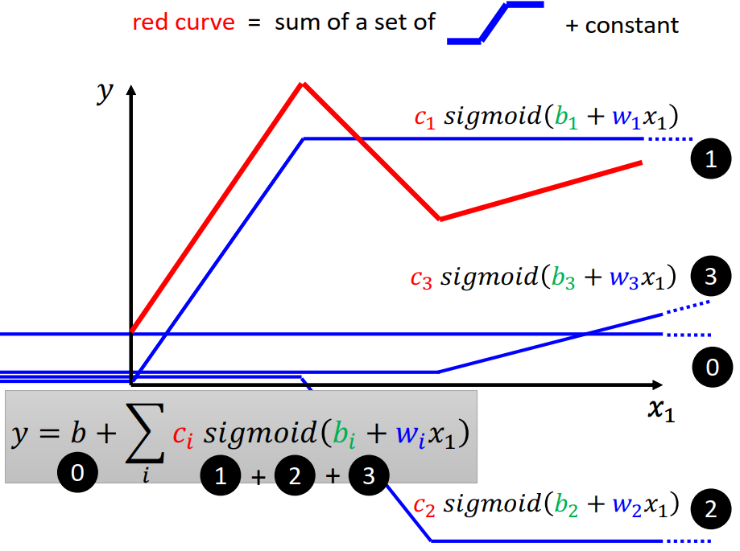

---
hackmd:
  url: https://hackmd.io/Pba4iR97TRWeiwVDOyX10w
  title: 機器學習與深度學習簡介
  lastSync: 2025-08-26T00:41:04.188Z
---
# 機器學習與深度學習簡介

## 什麼是機器學習？

- 機器學習本質上是在「尋找一個函數」(Looking for a Function)。
    
- 這個函數可以根據輸入（input）產生特定的輸出（output）。
    

### 範例：

- **語音辨識 (Speech Recognition)**：$f(聲音)="How are you"$  
    
- **圖像辨識 (Image Recognition)**：$f(圖片)="Cat"$ 
    
- **圍棋 (Playing Go)**：$f(棋盤狀態)="5-5"$(下一步棋)
    

## 不同類型的函數

### 1. **迴歸 (Regression)**

- 函數的輸出是一個**純量 (scalar)**。
    
- **範例**：根據今天的 PM2.5、氣溫等數據，預測明天的 PM2.5 值。
    

### 2. **分類 (Classification)**

- 函數的輸出是從給定的選項 (classes) 中選擇一個正確的。
    
- **範例**：垃圾郵件過濾器 $f(EMAIL)=Yes/No$。
    
- 在圍棋中，函數的輸出是 19x19 個格子中的一個，因此有 19×19 個 classes。
    

### 3. **結構化學習 (Structured Learning)**

- 函數的輸出是具有特定結構的內容，例如圖像或文件。
    
- 結構化學習可以看作是迴歸和分類的綜合應用。
    

## 如何尋找一個函數？

尋找函數的過程可以分為三個主要步驟：

### **Step 1: 定義一個帶有未知參數的函數 (Model)**

- 我們需要根據領域知識 (domain knowledge) 來定義一個函數模型。
    
- **範例**：預測 YouTube 觀看次數
    
    - 假設模型為線性函數：y=b+wx1​  
        
        - $y$: 2/26 的觀看次數 (number of views on 2/26)
            
        - $x_1$​: 2/25 的觀看次數 (number of views on 2/25)
            
        - b 和 w 是從數據中學習的未知參數，其中 w 稱為 **weight (權重)**，b 稱為 **bias (偏差)**。
            

### **Step 2: 定義損失函數 (Loss Function)**

- **損失 (Loss)** 是用來評估一組參數的好壞。
    
- **損失函數** L(b,w) 是參數的函數，用來衡量模型預測值與真實值之間的差距。
    
- **常見的損失函數**：
    
    - **均方誤差 (Mean Square Error, MSE)**：$L=\frac{1}{N}\sum\limits_{i=1}^n ​(y_i​−\hat{y_i}​)^2$
        
    - **平均絕對誤差 (Mean Absolute Error, MAE)**：$L=\frac{1}{N}\sum\limits_{i=1}^n ​|y_i​−\hat{y_i}​|$
        
    - **交叉熵 (Cross-entropy)**：當 $y$ 和 $\hat y$​ 都是機率分布時使用。
        
- 我們的目標是找到一組參數，使得損失函數的值最小。
    

### **Step 3: 最佳化 (Optimization)**

- 最佳化的目標是找到一組能使損失函數達到最小值的參數 $w^∗$ 和 b∗。
    
- $w^∗,b^∗=arg \ \underset{w,b}{min} ​L​$
    
- **梯度下降 (Gradient Descent)** 是一種常見的優化方法：
    
    1. **隨機初始化**：隨機選擇一組初始參數 $w^0$ 和 $b^0$。
        
    2. **計算梯度**：計算損失函數對參數的偏微分 $\frac{∂w}{∂L}​$ 和 $\frac{∂b}{∂L}$​，這代表了在參數空間中損失函數的「坡度」。
        
    3. **更新參數**：
        
        - $w_1←w_0−\ \eta \frac{∂w}{∂L}​\Big|_{w=w^0}​$
            
        - $b_1←b_0−\eta\frac{∂b}{∂L}​\Big|_{b=b_0}​$
            
        - η (eta) 稱為 **learning rate (學習率)**，是一個超參數 (hyperparameter)，控制每次更新的步長。
            
    4. **疊代更新**：重複步驟 2 和 3，直到損失函數的值不再顯著下降。
        
- **批次梯度下降 (Batch Gradient Descent)**：將訓練數據分成多個批次 (batch) 進行更新，而非一次性處理所有數據。一個 **epoch** 代表所有批次都被訓練過一次。
    

# 模型的限制與進階

簡單的線性模型有其局限性，當資料的關係不是線性的時候，它的表現會很差。因此，我們需要更複雜、更具彈性的模型。

- **超越線性模型**：
    - **Sigmoid 函數**：  

$$
\begin{align}
y&= c \cdot\frac{1}{1+e^{-(b+wx_1)}} \\ 
&=c\cdot sigmoid(b+wx_1)\end{align}
$$
        ​
    - **分段線性曲線**：可以通過多個 Sigmoid 函數的組合來近似任意連續曲線。  
        
        $y=b+\sum\limits_i ​c_i\cdot ​sigmoid(b_i​+w_i​x_1​)$

- **從單一特徵到多個特徵**：
    
    - 將模型擴展到多個輸入特徵 $x1​,x2​,…,xj$​。
        
    - $y=b+\sum\limits_i ​c_i\cdot ​sigmoid(b_i​+\sum\limits_j w_{ij}x_i)​)$
## **深度網路的運作原理**

- 深度網路的每一層都由多個神經元組成。
    
- 每個神經元會對輸入數據進行加權和 (weighted sum) 並加上偏差 (bias)，然後通過**激活函數 (Activation function)** 進行非線性轉換。
    
- 這些隱藏層的輸出會作為下一層的輸入，最終層的輸出即為模型的預測值。
    
- **範例**：
    
    - $r_i​=b_i​+\sum\limits_j ​w_{ij}​x_j​$
        
    - $a_i​=σ(r_i​)$ (其中 σ 是 Sigmoid 或 ReLU 等激活函數)
        
    - $r_i​=b_i​+\sum\limits_i c_i a_i$​  
    
- **神經網路 (Neural Network)**：
    
    - 上述模型正是單層神經網路的數學表示。
        
    - **輸入層**：輸入特徵 $x_j$​。
        
    - **隱藏層**：Sigmoid 函數組成的層。
        
    - **輸出層**：輸出 $y$。
    - 整個網絡的未知參數 (包括所有的 $w,b,c$) 可以用一個向量 $θ$ 來表示，並同樣使用梯度下降進行最佳化。

- **新模型的最佳化**：
    
    - 對於更複雜的模型（例如神經網路），損失函數 $\large L$ 是關於所有參數（weights 和 biases）的函數。
        
    - **梯度下降的更新公式**：
        - 假設模型有參數集合 $θ=[w11​,w12​,…,b1​,b2​,…,c1​,c2​,…]=[θ_1,θ_2,θ_3...]$。
        - Gradient  $g$
$$\begin{align}g&=\begin{bmatrix} \frac{∂L}{∂θ_1}\Big|_{θ=θ^0}\\\frac{∂L}{∂θ_2}\Big|_{θ=θ^0}\\\vdots \end{bmatrix}\\&=\nabla L(θ^0)\end{align}$$
	- 其中， $∇L(θ)$ 是梯度向量，包含損失函數對每個參數的偏導數：  
	          
$$
∇L(θ)=\begin{bmatrix}​\frac{∂L}{∂w11}\\\frac{∂L}{∂w12}\\\vdots\\\frac{∂L}{∂b1}\\​​\frac{∂L}{∂b2}\\\vdots​\end{bmatrix}
$$

$$
\begin{align}\begin{bmatrix}
θ_1^1\\θ_2^1\\\vdots\end{bmatrix}
&=\begin{bmatrix}θ_1^0\\θ_2^0\\\vdots\end{bmatrix}-
\begin{bmatrix} \eta\frac{∂L}{∂θ_1}\Big|_{θ=θ^0}\\\eta\frac{∂L}{∂θ_2}\Big|_{θ=θ^0}\\\vdots \end{bmatrix}\\
&=θ^1=θ^0 -\eta g\end{align}
$$

- 更新公式為：

$$\begin{align}
Compute\ gradient\ g &=\nabla L^1(θ^0)\\
θ^1&=θ^0 -\eta g\\
Compute\ gradient\ g &=\nabla L^2(θ^1)\\
θ^2&=θ^1 -\eta g\\
Compute\ gradient\ g &=\nabla L^3(θ^2)\\
θ^3&=θ^2-\eta g\\
\end{align}$$

- **ReLU (Rectified Linear Unit) 函數**：
    
    - 一種比 Sigmoid 更為常見的**激活函數 (Activation Function)**，其定義為：  
        
        ReLU(x)=max(0,x)
    - ReLU 函數的組合同樣可以近似任意連續曲線，且在實踐中往往表現更好。
