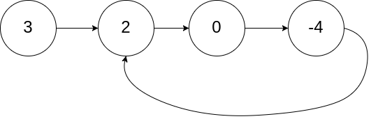
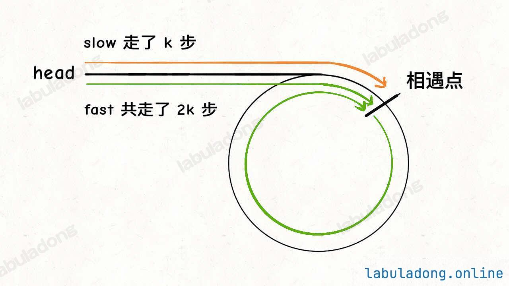

# [判斷連結串列是否包含環](https://labuladong.online/algo/essential-technique/linked-list-skills-summary-2/#%E5%88%A4%E6%96%AD%E9%93%BE%E8%A1%A8%E6%98%AF%E5%90%A6%E5%8C%85%E5%90%AB%E7%8E%AF)

判斷連結串列是否包含環屬於經典問題了，解決方案也是用快慢指標：

每當慢指標 `slow` 前進一步，快指標 `fast` 就前進兩步。

如果 `fast` 最終能正常走到連結串列末尾，說明連結串列中沒有環；如果 `fast` 走著走著竟然和 `slow` 相遇了，那肯定是 `fast` 在連結串列中轉圈了，說明連結串列中含有環。
```cpp
class Solution {
public:
    bool hasCycle(ListNode *head) {
        // 快慢指標初始化指向 head
        ListNode *slow = head, *fast = head;
        // 快指標走到末尾時停止
        while (fast != nullptr && fast->next != nullptr) {
            // 慢指標走一步，快指標走兩步
            slow = slow->next;
            fast = fast->next->next;
            // 快慢指標相遇，說明含有環
            if (slow == fast) {
                return true;
            }
        }
        // 不包含環
        return false;
    }
};
```
當然，這個問題還有進階版，也是力扣第 142 題「[環形連結串列 II](https://leetcode.cn/problems/linked-list-cycle-ii/)」：如果連結串列中含有環，如何計算這個環的起點？

舉個例子，環的起點是指下面這幅圖中的節點 2：


可以看到，當快慢指標相遇時，讓其中任一個指標指向頭節點，然後讓它倆以相同速度前進，再次相遇時所在的節點位置就是環開始的位置。

為什麼要這樣呢？這裡簡單說一下其中的原理。

我們假設快慢指標相遇時，慢指標 `slow` 走了 `k` 步，那麼快指標 `fast` 一定走了 `2k` 步：


`fast` 一定比 `slow` 多走了 `k` 步，這多走的 `k` 步其實就是 `fast` 指標在環裡轉圈圈，所以 `k` 的值就是環長度的「整數倍」。

假設相遇點距環的起點的距離為 `m`，那麼結合上圖的 `slow` 指標，環的起點距頭結點 `head` 的距離為 `k - m`，也就是說如果從 `head` 前進 `k - m` 步就能到達環起點。

巧的是，如果從相遇點繼續前進 `k - m` 步，也恰好到達環起點。因為結合上圖的 `fast` 指標，從相遇點開始走k步可以轉回到相遇點，那走 `k - m` 步肯定就走到環起點了：


所以，只要我們把快慢指標中的任一個重新指向 `head`，然後兩個指標同速前進，`k - m` 步後一定會相遇，相遇之處就是環的起點了。

```cpp
class Solution {
public:
    ListNode *detectCycle(ListNode *head) {
        ListNode *fast, *slow;
        fast = slow = head;
        while (fast != nullptr && fast->next != nullptr) {
            fast = fast->next->next;
            slow = slow->next;
            if (fast == slow) break;
        }
        // 上面的程式碼類似 hasCycle 函式
        if (fast == nullptr || fast->next == nullptr) {
            // fast 遇到空指標說明沒有環
            return nullptr;
        }

        // 重新指向頭結點
        slow = head;
        // 快慢指標同步前進(k-m步)，相交點就是環起點
        while (slow != fast) {
            fast = fast->next;
            slow = slow->next;
        }
        return slow;
    }
};
```
---
# [兩個連結串列是否相交](https://labuladong.online/algo/essential-technique/linked-list-skills-summary-2/#%E4%B8%A4%E4%B8%AA%E9%93%BE%E8%A1%A8%E6%98%AF%E5%90%A6%E7%9B%B8%E4%BA%A4)
給你輸入兩個連結串列的頭結點 `headA` 和 `headB`，這兩個連結串列可能存在相交。

如果相交，你的演演演算法應該返回相交的那個節點；如果沒相交，則返回 null。

比如題目給我們舉的例子，如果輸入的兩個連結串列如下圖：

那麼我們的算
那麼我們的演演演算法應該返回 `c1` 這個節點。

這個題直接的想法可能是用 `HashSet` 記錄一個連結串列的所有節點，然後和另一條連結串列對比，但這就需要額外的空間。

如果不用額外的空間，只使用兩個指標，你如何做呢？
難點在於，由於兩條連結串列的長度可能不同，兩條連結串列之間的節點無法對應：


如果用兩個指標 `p1` 和 `p2` 分別在兩條連結串列上前進，並不能**同時**走到公共節點，也就無法得到相交節點 `c1`。

**解決這個問題的關鍵是，透過某些方式，讓 `p1` 和 `p2` 能夠同時到達相交節點 `c1`**。

所以，我們可以讓 `p1` 遍歷完連結串列 `A` 之後開始遍歷連結串列 `B`，讓 `p2` 遍歷完連結串列 `B` 之後開始遍歷連結串列 `A`，這樣相當於「邏輯上」兩條連結串列接在了一起。

如果這樣進行拼接，就可以讓 `p1` 和 `p2` 同時進入公共部分，也就是同時到達相交節點 `c1`：


那你可能會問，如果說兩個連結串列沒有相交點，是否能夠正確的返回 null 呢？

這個邏輯可以覆蓋這種情況的，相當於 c1 節點是 null 空指標嘛，可以正確返回 null。
```cpp
class Solution {
public:
    ListNode* getIntersectionNode(ListNode* headA, ListNode* headB) {
        // p1 指向 A 連結串列頭結點，p2 指向 B 連結串列頭結點
        ListNode* p1 = headA;
        ListNode* p2 = headB;
        while (p1 != p2) {
            // p1 走一步，如果走到 A 連結串列末尾，轉到 B 連結串列
            p1 = (p1 == nullptr) ? headB : p1->next;
            // p2 走一步，如果走到 B 連結串列末尾，轉到 A 連結串列
            p2 = (p2 == nullptr) ? headA : p2->next;
        }
        return p1;
    }
};
```
## 長度差距法

> 當我們讓較長的鏈結串列先「跳過」幾個節點，會不會錯過交會點？
### 📘 為什麼不會錯過交會點

### 🔹 前提條件

設：

- `lenA = lenA_pre + lenC`
    
- `lenB = lenB_pre + lenC`  
    其中：
    
- `lenA_pre` = A 在交點之前的獨立長度
    
- `lenB_pre` = B 在交點之前的獨立長度
    
- `lenC` = 交點之後共享的長度


### 🔹 具體流程

1. 計算 `lenA`, `lenB`。
    
2. 設 `diff = |lenA - lenB|`。
    
3. 讓 **較長的鏈結串列** 先走 `diff` 步。
    
    - 如果 `lenA > lenB` → A 先走 `lenA - lenB` 步。
        
    - 如果 `lenB > lenA` → B 先走 `lenB - lenA` 步。
        
4. 之後兩個指標同時往前走，直到遇到相同節點（或 `nullptr`）。
    
### 🔹 為什麼不會跳過交會點

關鍵觀察：

- 交會點一定出現在 **尾端共享區段 (`lenC`)**。
    
- 我們讓較長的鏈結串列先「走差距 `diff`」，就是為了讓 **兩個指標剩下的步數一樣多**。
    

數學上：

假設 `lenA > lenB`：

- A 走 `lenA - lenB` 步後，剩下的長度 = `(lenB_pre + lenC)`。
    
- B 還沒走，剩下的長度也 = `(lenB_pre + lenC)`。
    

👉 所以此時 A 和 B **距離交會點的距離相同**。  
他們之後同步前進，不可能錯過交會點，只可能在交會點相遇，或最後一起到 `nullptr`。

### 🔹 ASCII 視覺化

範例：

```
A: a1 → a2 → a3
                  ↘
                   c1 → c2 → c3
                  ↗
B: b1
```

長度：

- `lenA = 5` (a1,a2,a3,c1,c2,c3)
    
- `lenB = 4` (b1,c1,c2,c3)
    
- `diff = 1`
    

步驟：

1. 讓 A 先走 1 步（到 a2）。
    
2. 現在 A 與 B 剩下的長度都 = 4。
    
3. 同步走：
    
    - A: a2 → a3 → c1 → c2 → c3
        
    - B: b1 → c1 → c2 → c3
        
4. 在 `c1` 相遇 ✅
    

👉 交會點一定不會被跳過。

### ✅ 結論

不會錯過交會點，原因是 **調整步數後，兩個指標距離交會點的距離相等**，因此同步移動時要嘛同時到達交會點，要嘛同時到 `nullptr`。

---
# [單連結串列的倒數第 `k` 個節點](https://labuladong.online/algo/essential-technique/linked-list-skills-summary/#%E5%8D%95%E9%93%BE%E8%A1%A8%E7%9A%84%E5%80%92%E6%95%B0%E7%AC%AC-k-%E4%B8%AA%E8%8A%82%E7%82%B9)
從前往後尋找單連結串列的第 k 個節點很簡單，一個 for 迴圈遍歷過去就找到了，但是如何尋找從後往前數的第 k 個節點呢？

那你可能說，假設連結串列有 n 個節點，倒數第 k 個節點就是正數第 n - k + 1 個節點，不也是一個 for 迴圈的事兒嗎？

是的，但是演演算法題一般只給你一個 ListNode 頭結點代表一條單連結串列，你不能直接得出這條連結串列的長度 n，而需要先遍歷一遍連結串列算出 n 的值，然後再遍歷連結串列計算第 n - k + 1 個節點。

也就是說，這個解法需要遍歷兩次連結串列才能得到出倒數第 k 個節點。

那麼，我們能不能只遍歷一次連結串列，就算出倒數第 k 個節點？可以做到的，如果是面試問到這道題，面試官肯定也是希望你給出只需遍歷一次連結串列的解法。

這個解法就比較巧妙了，假設 k = 2，思路如下：

首先，我們先讓一個指標 p1 指向連結串列的頭節點 head，然後走 k 步：

現在的 `p1`，只要再走 `n - k` 步，就能走到連結串列末尾的空指標了對吧？

趁這個時候，再用一個指標 `p2` 指向連結串列頭節點 `head`：

接下來就很顯然了，讓 `p1` 和 `p2` 同時向前走，`p1` 走到連結串列末尾的空指標時前進了 `n - k` 步，`p2` 也從 `head` 開始前進了 `n - k` 步，停留在第 `n - k + 1` 個節點上，即恰好停連結串列的倒數第 `k` 個節點上：

這樣，只遍歷了一次連結串列，就獲得了倒數第 `k` 個節點 `p2`。
```cpp
//
// Created by jorsonlee on 2025/8/26.
//
/**
 * Definition for singly-linked list.
 * struct ListNode {
 *     int val;
 *     ListNode *next;
 *     ListNode() : val(0), next(nullptr) {}
 *     ListNode(int x) : val(x), next(nullptr) {}
 *     ListNode(int x, ListNode *next) : val(x), next(next) {}
 * };
 */
class Solution {
public:
    ListNode* removeNthFromEnd(ListNode* head, int n) {
        ListNode* dummy = new ListNode(0);
        dummy->next = head;
        ListNode* fast = dummy;
        ListNode* slow = dummy;
        //Suppose there are m nodes, we want to remove last n-th node, in another word,we want to remove (m-n+1)-th node.
        //Inorder to remove (m-n+1)-th node, we need to move to (m-n)-th node
		//However, in this sort of problem we tend to use a dummy node, such that dummy->next = head, and we start at dummy node
		//So eventually, if we want to solve this problem:
		//remove last n-th node -> remove (m-n+1)-th node -> find (m-n)-th node -> first pointer move n+1 steps to find (n+1)-th node (since we start at dummy node)
		//at the same time,we add another pointer to dummy,then they move until first pointer is nullptr(first pointer moved m-n steps)
		//so does second pointer (second pointer locate at (m-n)-th node)
		for(int i = 0;i<n+1;i++){
            fast = fast->next;
        }
        
        while(fast!=nullptr){
            fast=fast->next;
            slow=slow->next;
        }
        
        ListNode *abort = slow->next;
        slow->next = slow->next->next;

        return dummy->next;

    }
};
```

# 📝 Dummy Node 在單向鏈表節點題目的好處

## 1️⃣ 統一刪除邏輯

- 無論刪除 **頭節點、尾節點或中間節點**，都可以使用統一操作：
    

```cpp
slow->next = slow->next->next;
```

- 不需要特判 head 或尾端節點
    
- 避免在程式中增加額外的 if 判斷
    
## 2️⃣ 保護 head 節點

- dummy 節點在 head 前面作為「前驅節點」
    
- 如果刪除的是 head：
    

```cpp
dummy -> head -> ... -> nullptr
```

- 刪除後只需返回 `dummy->next`，不會丟失鏈表頭
    
## 3️⃣ 保證 two-pointer 安全

- 在 two-pointer 技巧中：
    
    - slow 和 fast 都可以初始化在 dummy
        
    - fast 先走 n+1 步 → slow 最終正確停在要刪除節點的前一個節點
        
- 無需擔心 slow 或 fast 越過 head 或 nullptr，避免 null pointer runtime error
    

## 4️⃣ 適用於各種邊界情況

| 邊界情況    | 使用 dummy 的效果                                        |
| ------- | --------------------------------------------------- |
| 只有一個節點  | slow 停在 dummy，刪除節點後 dummy->next = nullptr，自動返回空鏈表   |
| 刪除 head | slow 停在 dummy，刪除後 dummy->next = head->next → 新 head |
| 刪除尾節點   | slow 停在倒數第二個節點，刪除最後節點後 slow->next = nullptr         |
| 刪除中間節點  | slow 停在前驅節點，刪除操作一致                                  |

## 5️⃣ 總結

**使用 dummy node 的核心價值**：

1. 統一邏輯，簡化程式
    
2. 無需特判 head 節點
    
3. 保護 slow/fast 指針安全，避免 null pointer
    
4. 自然處理所有邊界情況（唯一節點、頭、尾、中間）
    

> 💡 結論：在單向鏈表刪除操作中，dummy node 幾乎是標準做法，特別是在使用 two-pointer 技巧時，能大幅降低出錯率。

---

如果你願意，我可以再畫一個 **ASCII 圖**，展示 dummy node + slow/fast 在各種邊界情況下的操作流程，幫助直觀理解。

你希望我畫嗎？